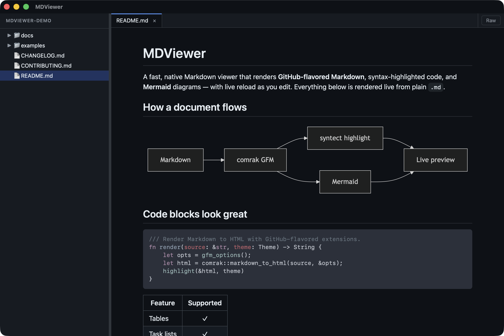

# mdviewer

[](https://github.com/larsakeekstrand/mdviewer/actions/workflows/ci.yml)
[](LICENSE)

A markdown viewer and editor for macOS and Windows with a VS Code–style file tree, a beautifully rendered preview, and in-app source editing, built in Rust on Tauri 2.



## Features

- VS Code–style file tree (lazy expansion, shows every file on disk) that updates live as files are added, removed, or renamed by other apps
- **Git status decoration** — `M` / `A` / `U` / `D` badges on modified, added, untracked, and deleted files when the folder is a git repo, with directory roll-up
- GitHub-flavored markdown rendering with syntax-highlighted code blocks
- **Mermaid diagrams** rendered inline, with hover-revealed **SVG / PNG export** buttons on each diagram (Retina-quality PNG with white background)
- **LaTeX math** via KaTeX — inline `$…$` and display `$$…$$`, with the strict GFM delimiter rules (so `$5 and $10` stays as text)
- **Copy button** on every fenced code block (hover to reveal)
- **Interactive task lists** — click a `- [ ]` / `- [x]` checkbox in the rendered view and the change is written back to the source file atomically
- **In-app editing** — click **Edit** (or **Actions ▸ Toggle Edit**) to open a side-by-side split: a CodeMirror source editor on the left, the live-rendered preview on the right (re-renders as you type). Save with ⌘S (**Actions ▸ Save**). Unsaved tabs show a ● dot. If the file changes on disk while you have unsaved edits, a banner lets you choose to reload or keep your version. The editor is hidden for image tabs.
- **File management from the tree** — right-click any file or folder row (or the sidebar background) for **New File…**, **New Folder…**, **Rename…**, **Duplicate** (files only), and **Delete**. Rename uses VS Code–style inline editing; Enter commits, Esc cancels. Delete moves to the system **Trash** (recoverable). Open tabs follow a rename, and tabs under a deleted path are closed.
- **Review Mode** — click **💬 Review** to annotate a rendered document: hover any block for a gutter **+**, attach a comment, and add a document-wide general note. Clicking the toggle again — now **✓ Finish & Copy** — puts a structured markdown summary (the file path, your note, and each quoted block with its comment, in document order) on the clipboard — ready to paste into an AI coding assistant like Claude Code. Comments re-anchor to their blocks across live reloads; ones whose text changed are flagged. Annotations are per-tab and ephemeral (not saved to disk).
- **In-document find** (⌘F) with case-sensitive and whole-word toggles, match count, and next/previous navigation
- **Folder content search** (⌘⇧F) — recursively search every file in the open tree (or a single folder via right-click). Case-sensitive, whole-word, and an "include .gitignored files" toggle (off by default — `.gitignore` / `.ignore` / global gitignore are honored like ripgrep). Click a result to open the file and jump the preview to the matching line.
- **Document export** — export the rendered page to **self-contained HTML** (CSS, fonts, and local images inlined; always light-themed) or **PDF** (macOS only — opens a dedicated **Export to PDF** window with three presets — **Clean**, **Report** (serif body, justified), and **Compact** (denser) — plus adjustable base font size, paper size (A4 / Letter / Legal), margins (Narrow / Normal / Wide), and page numbers (none, bottom-center, or bottom-right). A **live preview** updates as you tune the settings; switch to the **Exact PDF** tab to render the real file — correct page breaks, margins, and footers — before you commit. Settings persist as your global default and are also used by the MCP `generate_pdf` tool. Smart page breaks keep headings with their content, prevent atomic blocks from splitting, and scale wide tables to fit.)
- Live reload when the open file changes on disk
- Tabs with VS Code–style sticky/preview behavior (single-click replaces preview, double-click sticks)
- **Session restore** — the last folder you opened and your open tabs are reopened on the next launch
- Per-tab raw / rendered toggle
- **Image files** — click an image (`png`, `jpg`, `gif`, `webp`, `avif`, `bmp`, `ico`, `svg`) to view it at actual size, with live reload when it changes on disk
- **Open from Finder** — set MDViewer as the default app for `.md` files and double-click to open them
- File menu with **Open File…**, **Open Folder…**, and **Open Recent** (persisted)
- Custom right-click context menu — in the preview (Copy / Copy Source / Show Raw·Rendered) and on tree rows (Copy Relative / Absolute Path)
- **Light / dark theme toggle** — a toolbar button (next to **Raw**) switches the whole app between light and dark; the app follows the macOS appearance until you choose, then remembers your choice across launches
- CLI: `mdviewer [file-or-directory]`
- **Install Command Line Tool** — one menu click symlinks `mdviewer` into `/usr/local/bin` so you can launch it from any terminal
- **Claude Code integration** — **MDViewer ▸ Install Claude Code Hook…** adds a `PostToolUse` hook to the open project's `.claude/settings.local.json` so that plan/spec/design markdown files Claude Code writes there open automatically in MDViewer (paired with **Review Mode**, this closes the read-here / act-in-terminal loop)
- **MCP server for Claude Code** — install with **MDViewer ▸ Install MCP
  Server…**; Claude can then open documents in MDViewer (`open_document`),
  check what you're reading (`get_viewer_state`), request a review
  (`request_review`), and generate a PDF (`generate_pdf`). For a review the
  document opens in Review Mode with a banner, and **✓ Finish & Send** delivers
  your comments straight back to the waiting Claude session — no clipboard step.
  **Decline** (or closing the tab) tells Claude you're skipping it. Reviews can
  take as long as you need; if a review runs into a client-side tool timeout,
  raise `MCP_TOOL_TIMEOUT` in the Claude Code environment. `generate_pdf`
  renders a markdown file to a PDF (using your saved PDF export settings —
  preset, font size, paper, margins, and page numbers) and writes it inside
  the open folder — both the source and the output must be within that folder.
- **Claude Code Integration panel** — **MDViewer ▸ Claude Code Integration…**
  opens a window showing, for the current project, whether the hook and MCP
  server are installed, with one-click **Install**/**Update** buttons and a
  short explanation of each (plus Review Mode). When you open a git project
  that has neither set up, a one-time banner offers to set it up; dismissing it
  silences the prompt for good.
- **One-click auto-update** — MDViewer checks for new releases on launch and then once an hour while it's running; when a newer release is published, a dismissible banner downloads, installs, and restarts the signed update in-app, and a **What's new** button on the banner shows that release's changelog in an in-app window before you decide
- **Beta update channel** — opt in via **MDViewer ▸ Settings…** to receive pre-release builds as soon as they publish, and roll onto stable automatically when a final release follows

## Install

### macOS

The macOS build targets Apple Silicon (M1 / M2 / M3 / M4). Builds are not signed by an Apple Developer ID, so you have to remove macOS's quarantine flag once after installing.

#### 1. Download

Grab `MDViewer_<version>_macOS_aarch64.dmg` from the [latest release](https://github.com/larsakeekstrand/mdviewer/releases/latest).

#### 2. Install

Open the `.dmg` and drag `MDViewer.app` to `Applications`.

#### 3. Remove the quarantine flag (required)

When you download an unsigned app through a browser, macOS attaches a quarantine attribute. On macOS 15 (Sequoia) and newer, Gatekeeper then refuses to launch it with **"mdviewer" is damaged and cannot be opened**. That message is misleading — the app is fine; macOS is just blocking it. Clear the flag once from Terminal:

```sh
sudo xattr -dr com.apple.quarantine /Applications/MDViewer.app
```

You'll be prompted for your password. After this, double-click `mdviewer` in Applications — it'll open normally, and you won't have to repeat this step on future launches.

> The older right-click → Open workaround that some guides mention no longer works on Sequoia+ for browser-downloaded apps. The `xattr` command is the supported way to bypass Gatekeeper for software you trust.

> You only need the `xattr` step for this initial manual install. Later releases arrive through the in-app **one-click auto-update** banner, which downloads and swaps the bundle in-process — those updates are never quarantined, so you won't have to clear the flag again.

### Windows

Download either installer from the
[latest release](https://github.com/larsakeekstrand/mdviewer/releases/latest):

- `MDViewer_<version>_Windows_x64-setup.exe` — NSIS installer, smaller, per-user
  install (installs into `%LOCALAPPDATA%\Programs\...`, no admin prompt).
- `MDViewer_<version>_Windows_x64_en-US.msi` — MSI installer, for enterprise /
  Group Policy deployment.

#### First-run SmartScreen warning

Builds are unsigned. On first install, Windows Defender SmartScreen
will show "Windows protected your PC". Click **More info** → **Run
anyway** once. After install, MDViewer launches normally from the
Start Menu.

#### WebView2

The installer auto-downloads Microsoft Edge WebView2 Runtime if it
isn't already present (it usually is on Windows 10 1903+ and
Windows 11). An internet connection is required during install in
that case.

## Usage

### Launching

- **From Applications**: double-click `mdviewer`. The tree is rooted at the last folder you had open (the current working directory on a first-ever launch), and the tabs from your previous session are reopened.
- **By double-clicking a `.md` file in Finder**: once MDViewer is set as the default app for Markdown (Finder ▸ *Get Info* ▸ *Open With* ▸ select MDViewer ▸ *Change All…*), double-clicking any `.md` file opens it in MDViewer with the tree rooted at the file's folder.
- **From the command line**: pass a file or a directory. Files open rendered with the tree rooted at the file's parent; directories just root the tree there.

  ```sh
  mdviewer ~/notes/today.md      # opens the file, tree at ~/notes
  mdviewer ~/notes               # tree at ~/notes, nothing pre-opened
  mdviewer                       # tree at current working directory
  ```

  (To run `mdviewer` from a terminal, use **MDViewer ▸ Install Command Line Tool…** — it symlinks the app's binary into `/usr/local/bin`, which is already on your `$PATH`, prompting for your password if that directory needs admin rights. To do it by hand instead: `sudo ln -s /Applications/MDViewer.app/Contents/MacOS/mdviewer /usr/local/bin/mdviewer`.)

### File tree

- Click a folder to expand or collapse it.
- **Single-click** a file → opens it in the *preview* tab (italic title). Single-clicking another file replaces it.
- **Double-click** a file → opens it as a *sticky* tab (regular title) that won't be replaced by future single-clicks.
- The **active tab's file is revealed in the tree** — its folders expand, its row scrolls into view, and it's highlighted with an accent bar — so you always know which file you're looking at. (Files opened from outside the current folder simply aren't highlighted.)
- Every file on disk is shown — including dotfiles, entries matched by `.gitignore`, and `node_modules` / `target`.
- The tree updates live: files added, removed, or renamed by other apps in the root or any expanded folder appear without reopening the folder, and git badges refresh with them.
- Markdown files render as a preview; image files open as images; anything else is shown as plain text.

### Tabs

- Single-click a tab to activate it.
- Double-click a tab to promote a preview tab to sticky.
- Click the **×** on the tab or middle-click the tab to close it.
- The active tab's file is watched on disk; saves elsewhere live-reload the preview while preserving scroll position.

### Raw vs rendered view

Each tab can be viewed rendered (default) or raw. Toggle with the **Raw** button at the top-right of the tab bar, or via the **Actions ▸ Toggle Raw** menu item, or via the right-click context menu. The toggle is per tab.

### Review Mode

Click **💬 Review** at the top-right of the tab bar to turn the rendered document into a review surface — useful when you're reading a plan, spec, or report produced by an AI coding assistant and want to send back precise feedback. A hint at the top of the document explains the flow.

- Hover any block (paragraph, heading, list item, code block) to reveal a **+** in the left margin; click it to attach a comment. **Save** (or Enter) commits it; **Cancel** (or Esc) discards. Saved blocks get a blue left-border and a comment card; click a card to edit, **×** to delete.
- The **general note** field (below the hint) captures document-wide feedback.
- When you're done, click the toggle again — now **✓ Finish & Copy** — to assemble everything into one markdown block (the file's path, the general note, and each annotated block quoted with its comment in document order), copy it to the clipboard, clear the annotations, exit review mode, and confirm with a toast. Paste it straight into your assistant. (Finishing with nothing to send just exits.)
- Comments are anchored to block text, so they survive live reloads and follow their block when the document is rewritten above them; a comment whose block text changed is surfaced separately with a "⚠ this block changed" tag. Annotations live only for the session — they aren't written to disk, and they're excluded from exports.

Review Mode is available on rendered markdown only (hidden in Raw view, Edit mode, and on image tabs).

### Theme

Switch between light and dark with the **☾ / ☀** button at the top-right of the tab bar (left of **Raw**); the icon shows the theme you'll switch to. Until you press it, MDViewer follows your macOS appearance live; once you choose, that choice is remembered across launches and the app stops auto-following the OS. The theme applies everywhere — file tree, tabs, rendered markdown, syntax-highlighted code, Mermaid diagrams, and math. (Exports are always light regardless of the in-app theme.)

### Menus

- **MDViewer ▸ Check for Updates…** — manually checks GitHub for a newer release (the same check also runs silently on startup). **View Source on GitHub** opens the repository.
- **MDViewer ▸ Install Command Line Tool…** — symlinks `mdviewer` into `/usr/local/bin` so you can launch it from a terminal (prompts for your password if the directory needs admin rights).
- **MDViewer ▸ Install Claude Code Hook…** — adds a `PostToolUse` hook to the open project's `.claude/settings.local.json` so plan/spec/design markdown files Claude Code writes there open automatically in MDViewer. Re-running updates the path in place (no duplicate). Requires a folder to be open; the personal `settings.local.json` is not committed.
- **MDViewer ▸ Install MCP Server…** — merges the MDViewer MCP server into the open project's `.mcp.json` so Claude Code can open documents and request reviews in the viewer. Re-running updates the path in place. Requires a folder to be open.
- **MDViewer ▸ Claude Code Integration…** — opens the integration window
  (install state + Install/Update buttons + explanations) for the open project.
- **File ▸ Open File…** (⌘O) — opens any markdown file. The tree stays where it is; the file opens as a sticky tab.
- **File ▸ Open Folder…** (⇧⌘O) — re-roots the tree at any folder.
- **File ▸ Open Recent** — the last 10 folders you've opened (persisted across launches). The bottom **Clear Recent** entry wipes the list.
- **File ▸ Export as HTML…** — exports the active tab's rendered document as a fully self-contained HTML file (CSS, fonts, and local images inlined; always light-themed).
- **File ▸ Export as PDF…** *(macOS only)* — opens the **Export to PDF** window where you can choose a preset (Clean / Report / Compact), adjust the base font size, paper size (A4 / Letter / Legal), margins (Narrow / Normal / Wide), and page numbers (None / Bottom center / Bottom right). The **live preview** on the left updates as you change settings; switch to **Exact PDF** to render the actual file — with real page breaks, margins, and footers — before saving. Your settings are saved as the global default and are also applied when the MCP `generate_pdf` tool generates a PDF.
- **Actions** — Cut (⌘X), Copy (⌘C), Paste (⌘V), Select All (⌘A), Find… (⌘F), Search Files… (⇧⌘F), Copy Source, Toggle Raw, Toggle Edit, Save (⌘S).
- **MDViewer ▸ Settings…** (⌘,) — opens the Preferences window where you can opt in to beta (pre-release) updates.

### Beta updates

MDViewer can track a beta (pre-release) channel. Open **MDViewer ▸ Settings…**
(⌘,) and tick **Receive beta (pre-release) updates** to opt in. From then on the
in-app update check follows the beta channel, which always offers the newest
build — including stable releases — so a beta tester is never left behind a
final release. Untick the box to return to stable-only updates; the change takes
effect at the next update check (no restart needed). Beta builds may be less
stable than final releases.

### Right-click

Right-clicking anywhere in the preview shows a compact menu with Copy / Copy Source / Show Raw·Rendered. Right-clicking in the source editor or any text field (search box, inline rename, review note) shows a compact **Cut / Copy / Paste / Select All** menu. Right-clicking a row in the file tree shows **Copy Relative Path** (relative to the sidebar root) and **Copy Absolute Path**, file management actions (**New File…**, **New Folder…**, **Rename…**, **Duplicate**, **Delete**), and on folder rows a **Search in Folder…** entry that opens a sidebar takeover for content search inside that folder. Right-clicking the sidebar background offers the same file management and search actions for the whole tree root. macOS's default text menu (Look Up, Translate, Writing Tools, Speech, …) is suppressed.

## Build from source

```sh
cd src-tauri
cargo build --release
```

The release binary lands at `src-tauri/target/release/mdviewer`.

To produce a platform bundle:

```sh
cargo install tauri-cli --version "^2"
cd src-tauri
cargo tauri build
```

Bundles end up under `src-tauri/target/release/bundle/`. On macOS that's
`.app` and `.dmg` under `macos/` and `dmg/`. On Windows (`cargo tauri build`),
the bundler produces both:

- `src-tauri/target/release/bundle/nsis/MDViewer_<version>_x64-setup.exe`
- `src-tauri/target/release/bundle/msi/MDViewer_<version>_x64_en-US.msi`

Regenerate `src-tauri/icons/icon.ico` from `icon.svg` with
`cargo tauri icon icon.svg` if the source SVG changes.

## Develop

```sh
cd src-tauri
cargo run -- ../README.md
```

CI (`.github/workflows/ci.yml`) runs `cargo fmt --check`, `cargo clippy -- -D warnings`, and `cargo test` on every push and PR.

## Cut a release

Before tagging, add a `## [X.Y.Z] - DATE` section to `CHANGELOG.md` with short, user-facing bullets — the workflow extracts it for the release notes (the GitHub release page and the in-app "What's new" modal), falling back to the raw commit log when a version has no section.

Push a `v*` tag to trigger `.github/workflows/release.yml`. It builds for `aarch64-apple-darwin` and `x86_64-pc-windows-msvc`, then attaches the `.dmg`, `.app.tar.gz`, `.exe`, and `.msi` artifacts to a draft GitHub Release that you publish manually.

```sh
git tag v0.1.0
git push origin v0.1.0
```

The same workflow can also be re-run from the Actions tab via **Run workflow** by entering an existing tag name — useful if one of the arch builds failed and you want to retry without re-tagging.

## License

[MIT](LICENSE)
