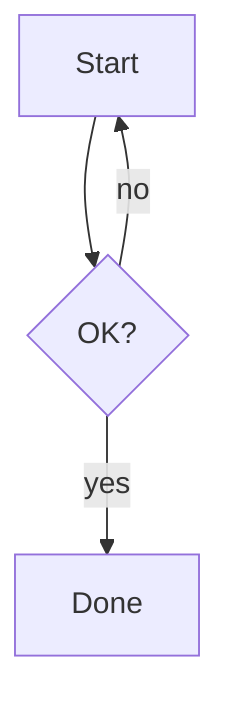
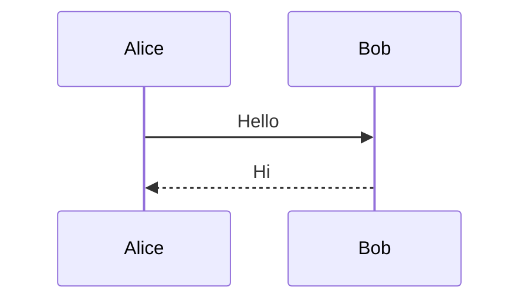

# Mermaid Diagram Rendering Implementation Plan

> **For agentic workers:** REQUIRED SUB-SKILL: Use superpowers:subagent-driven-development (recommended) or superpowers:executing-plans to implement this plan task-by-task. Steps use checkbox (`- [ ]`) syntax for tracking.

**Goal:** Render ` ```mermaid ` fenced code blocks as live, theme-aware SVG diagrams in the preview instead of plain code text.

**Architecture:** The Rust backend registers a comrak `CodefenceRendererAdapter` for the `mermaid` language so those fences emit `<pre class="mermaid">…source…</pre>` (every other language still flows through syntect). The frontend vendors `mermaid.min.js`, and after each morphdom render it turns `.mermaid` blocks into SVG — following the app's light/dark theme, preserving already-rendered diagrams across live reloads, and showing an inline error (not a crash) for invalid diagrams.

**Tech Stack:** Rust + comrak 0.52 (`CodefenceRendererAdapter`); vanilla JS frontend + vendored mermaid 11.15.0 (`dist/mermaid.min.js`, single self-contained file that sets `window.mermaid`); morphdom.

---

## File structure

- `src-tauri/src/markdown.rs` — **modify.** Add a `MermaidRenderer` (`CodefenceRendererAdapter`) + a small HTML-escape helper; register it in `render_markdown`. Add a `#[cfg(test)]` module. This is the only backend change.
- `ui/mermaid.min.js` — **create** (vendored, ~3.3 MB).
- `ui/index.html` — **modify.** Load `mermaid.min.js` before the `app.js` module.
- `ui/app.js` — **modify.** Init mermaid; render `.mermaid` blocks after morphdom; preserve unchanged diagrams; re-theme on appearance change; inline error fallback.
- `ui/styles.css` — **modify.** Strip code-block chrome from `pre.mermaid`, center the SVG, hide source until rendered, style the error fallback.

Confirmed comrak 0.52 facts this plan relies on:
- `RenderPlugins.codefence_renderers: HashMap<String, &dyn CodefenceRendererAdapter>`; when a renderer is registered for a language, comrak calls `adapter.write(...)` and **returns early** (it does *not* append `</code></pre>`), so output is exactly what we write.
- `CodefenceRendererAdapter::write(&self, output: &mut dyn std::fmt::Write, lang: &str, meta: &str, code: &str, sourcepos: Option<Sourcepos>) -> std::fmt::Result`.
- `code` is the raw, unescaped fence body (`ncb.literal`); we escape it ourselves.

---

## Task 1: Backend — emit `<pre class="mermaid">` for mermaid fences (TDD)

**Files:**
- Modify: `src-tauri/src/markdown.rs`
- Test: `src-tauri/src/markdown.rs` (`#[cfg(test)] mod tests`)

- [ ] **Step 1: Write the failing tests**

Append this module at the end of `src-tauri/src/markdown.rs`:

```rust
#[cfg(test)]
mod tests {
    use super::*;

    #[test]
    fn mermaid_fence_renders_as_mermaid_pre() {
        let html = render_markdown("```mermaid\ngraph TD;\n  A-->B;\n```\n", "light");
        assert!(
            html.contains("<pre class=\"mermaid\""),
            "expected a mermaid pre, got: {html}"
        );
        // Source is preserved and HTML-escaped (`>` -> `&gt;`).
        assert!(html.contains("A--&gt;B"), "expected escaped source, got: {html}");
        // It must NOT have gone through syntect (no inline highlight markup).
        assert!(
            !html.contains("background-color"),
            "mermaid block should bypass syntect, got: {html}"
        );
        assert!(!html.contains("language-mermaid"), "got: {html}");
    }

    #[test]
    fn non_mermaid_fence_still_highlighted() {
        let html = render_markdown("```rust\nfn main() {}\n```\n", "light");
        // syntect emits an inline background-color on the <pre>.
        assert!(
            html.contains("background-color"),
            "rust block should still be syntect-highlighted, got: {html}"
        );
    }
}
```

- [ ] **Step 2: Run the tests to verify they fail**

Run: `cd src-tauri && cargo test --lib markdown`
Expected: `mermaid_fence_renders_as_mermaid_pre` FAILS (currently the mermaid fence goes through syntect, so `<pre class="mermaid"` is absent and `background-color` is present). `non_mermaid_fence_still_highlighted` should PASS already.

- [ ] **Step 3: Add imports**

At the top of `src-tauri/src/markdown.rs`, the imports currently are:

```rust
use std::sync::LazyLock;

use comrak::options::Plugins;
use comrak::plugins::syntect::SyntectAdapter;
use comrak::{markdown_to_html_with_plugins, Options};
```

Replace that block with:

```rust
use std::fmt;
use std::sync::LazyLock;

use comrak::adapters::CodefenceRendererAdapter;
use comrak::nodes::Sourcepos;
use comrak::options::Plugins;
use comrak::plugins::syntect::SyntectAdapter;
use comrak::{markdown_to_html_with_plugins, Options};
```

- [ ] **Step 4: Add the renderer + escape helper**

Insert these items immediately above the existing `pub fn render_markdown` in `src-tauri/src/markdown.rs`:

```rust
struct MermaidRenderer;

impl CodefenceRendererAdapter for MermaidRenderer {
    fn write(
        &self,
        output: &mut dyn fmt::Write,
        _lang: &str,
        _meta: &str,
        code: &str,
        sourcepos: Option<Sourcepos>,
    ) -> fmt::Result {
        output.write_str("<pre class=\"mermaid\"")?;
        if let Some(sp) = sourcepos {
            output.write_str(" data-sourcepos=\"")?;
            output.write_str(&sp.to_string())?;
            output.write_str("\"")?;
        }
        output.write_str(">")?;
        write_html_escaped(output, code)?;
        output.write_str("</pre>\n")
    }
}

fn write_html_escaped(output: &mut dyn fmt::Write, s: &str) -> fmt::Result {
    for c in s.chars() {
        match c {
            '&' => output.write_str("&amp;")?,
            '<' => output.write_str("&lt;")?,
            '>' => output.write_str("&gt;")?,
            _ => output.write_char(c)?,
        }
    }
    Ok(())
}
```

- [ ] **Step 5: Register the renderer in `render_markdown`**

Replace the body of `render_markdown` with:

```rust
pub fn render_markdown(source: &str, theme: &str) -> String {
    let opts = build_options();
    let adapter: &SyntectAdapter = match theme {
        "dark" => &DARK_ADAPTER,
        _ => &LIGHT_ADAPTER,
    };
    let mermaid = MermaidRenderer;
    let mut plugins = Plugins::default();
    plugins.render.codefence_syntax_highlighter = Some(adapter);
    plugins
        .render
        .codefence_renderers
        .insert("mermaid".to_string(), &mermaid);
    markdown_to_html_with_plugins(source, &opts, &plugins)
}
```

(`mermaid` is declared before `plugins` so it outlives the borrow held in `codefence_renderers`.)

- [ ] **Step 6: Run the tests to verify they pass**

Run: `cd src-tauri && cargo test --lib markdown`
Expected: both tests PASS.

- [ ] **Step 7: Lint**

Run: `cd src-tauri && cargo fmt && cargo clippy --all-targets -- -D warnings`
Expected: no warnings, no diffs left by fmt.

- [ ] **Step 8: Commit**

```bash
git add src-tauri/src/markdown.rs
git commit -m "Render mermaid fences as <pre class=mermaid> instead of code"
```

---

## Task 2: Vendor mermaid.min.js and load it

**Files:**
- Create: `ui/mermaid.min.js`
- Modify: `ui/index.html`

- [ ] **Step 1: Download the pinned mermaid build**

Run:

```bash
curl -fsSL "https://cdn.jsdelivr.net/npm/mermaid@11.15.0/dist/mermaid.min.js" -o ui/mermaid.min.js
```

- [ ] **Step 2: Verify it is the right, self-contained file**

Run:

```bash
wc -c ui/mermaid.min.js
tail -c 80 ui/mermaid.min.js
```

Expected: size ~3.3 MB; the tail ends with `globalThis["mermaid"] = globalThis.__esbuild_esm_mermaid_nm["mermaid"].default;` (this is what makes `window.mermaid` exist). If the tail does not contain that line, the wrong artifact was downloaded — stop and recheck the URL/version.

- [ ] **Step 3: Load it before the app module**

In `ui/index.html`, the scripts at the bottom currently are:

```html
    <script src="morphdom-umd.min.js"></script>
    <script type="module" src="app.js"></script>
```

Replace with:

```html
    <script src="morphdom-umd.min.js"></script>
    <!-- mermaid 11.15.0 dist/mermaid.min.js; sets window.mermaid. Classic
         script so it runs before the deferred app.js module. -->
    <script src="mermaid.min.js"></script>
    <script type="module" src="app.js"></script>
```

- [ ] **Step 4: Build to confirm the frontend still bundles**

Run: `cd src-tauri && cargo build`
Expected: builds successfully (Tauri embeds `../ui` at compile time; this just confirms the new asset is picked up).

- [ ] **Step 5: Commit**

```bash
git add ui/mermaid.min.js ui/index.html
git commit -m "Vendor mermaid 11.15.0 and load it before app.js"
```

---

## Task 3: Frontend rendering, live-reload preservation, theming, and error fallback

No JS test harness exists in this project (vanilla JS, no build step), so these steps add complete code and are verified by the manual run in Task 4. Each step shows the exact edit.

**Files:**
- Modify: `ui/app.js`
- Modify: `ui/styles.css`

- [ ] **Step 1: Add mermaid init + render helpers**

In `ui/app.js`, immediately after the `colorScheme()` function (the block that ends with `: "light";` followed by its closing `}`), add:

```js
function mermaidTheme(theme) {
  return theme === "dark" ? "dark" : "default";
}

function initMermaid() {
  if (!window.mermaid) return;
  window.mermaid.initialize({
    startOnLoad: false,
    securityLevel: "strict",
    theme: mermaidTheme(currentTheme),
  });
}

function mermaidSource(el) {
  return (el.textContent || "").trim();
}

/** Insert a mermaid-produced SVG string as a parsed node (never as a raw
 *  HTML string), so nothing in the SVG can execute even if it slipped past
 *  mermaid's strict sanitization. */
function setSvg(el, svg) {
  const node = new DOMParser().parseFromString(svg, "text/html").body
    .firstElementChild;
  if (node) el.replaceChildren(node);
}

let mermaidIdSeq = 0;

async function renderMermaid({ force = false } = {}) {
  if (!window.mermaid) return;
  for (const el of preview.querySelectorAll("pre.mermaid")) {
    // Already-rendered/errored blocks that morphdom preserved keep their
    // state; only (re)render fresh, changed, or force-reset ones.
    if (!force && el.dataset.mvState) continue;
    const src = mermaidSource(el);
    const id = "mmd-" + mermaidIdSeq++;
    try {
      const { svg } = await window.mermaid.render(id, src);
      setSvg(el, svg);
      el.dataset.mvState = "ok";
      el.dataset.mermaidSrc = src;
    } catch (e) {
      const orphan =
        document.getElementById("d" + id) || document.getElementById(id);
      if (orphan) orphan.remove();
      el.replaceChildren(buildMermaidError(src, e));
      el.dataset.mvState = "err";
      el.dataset.mermaidSrc = src;
    }
  }
}

function buildMermaidError(src, err) {
  const wrap = document.createElement("div");
  wrap.className = "mermaid-error";
  const msg = document.createElement("div");
  msg.className = "mermaid-error-msg";
  msg.textContent =
    "Mermaid diagram error: " + (err && err.message ? err.message : String(err));
  const pre = document.createElement("pre");
  pre.className = "mermaid-error-src";
  const code = document.createElement("code");
  code.textContent = src;
  pre.appendChild(code);
  wrap.appendChild(msg);
  wrap.appendChild(pre);
  return wrap;
}
```

- [ ] **Step 2: Initialize mermaid at startup**

In `ui/app.js`, `init()` begins:

```js
async function init() {
  const initial = await invoke("get_initial_state");
```

Insert `initMermaid();` as the first statement:

```js
async function init() {
  initMermaid();
  const initial = await invoke("get_initial_state");
```

- [ ] **Step 3: Re-theme diagrams on appearance change**

In `ui/app.js`, replace this existing listener inside `init()`:

```js
  window
    .matchMedia("(prefers-color-scheme: dark)")
    .addEventListener("change", async () => {
      currentTheme = colorScheme();
      if (activeTab()) await renderActive({ scrollLock: false });
    });
```

with:

```js
  window
    .matchMedia("(prefers-color-scheme: dark)")
    .addEventListener("change", async () => {
      currentTheme = colorScheme();
      initMermaid();
      if (activeTab())
        await renderActive({ scrollLock: false, forceMermaid: true });
    });
```

- [ ] **Step 4: Update the `renderActive` signature**

In `ui/app.js`, replace the function signature line:

```js
async function renderActive({ scrollLock } = { scrollLock: true }) {
```

with:

```js
async function renderActive(
  { scrollLock = true, forceMermaid = false } = {},
) {
```

(All existing callers pass `{ scrollLock: ... }`, so they keep working; `forceMermaid` defaults to `false`.)

- [ ] **Step 5: Render diagrams after morphdom + preserve unchanged ones**

In `ui/app.js`, inside `renderActive`, replace this block:

```js
  window.morphdom(preview, incoming, {
    onBeforeElUpdated: (fromEl, toEl) => !fromEl.isEqualNode(toEl),
  });

  annotateLinks();
```

with:

```js
  window.morphdom(preview, incoming, {
    onBeforeElUpdated: (fromEl, toEl) => {
      // Keep an already-rendered diagram if its source is unchanged, so
      // editing nearby prose doesn't re-render (and flicker) the SVG.
      if (
        !forceMermaid &&
        fromEl.dataset &&
        fromEl.dataset.mvState &&
        fromEl.classList &&
        fromEl.classList.contains("mermaid") &&
        fromEl.dataset.mermaidSrc === mermaidSource(toEl)
      ) {
        return false;
      }
      return !fromEl.isEqualNode(toEl);
    },
  });

  annotateLinks();

  if (!result.raw) await renderMermaid({ force: forceMermaid });
```

(This runs diagram rendering before the existing `restoreAnchor(anchor)` call that follows, so scroll math uses final heights.)

- [ ] **Step 6: Style mermaid blocks**

In `ui/styles.css`, after the existing block:

```css
.markdown-body code {
  font-family: ui-monospace, SFMono-Regular, "SF Mono", Menlo, Consolas, monospace;
}
```

add:

```css
/* Mermaid diagrams: strip the code-block chrome and center the SVG. */
.markdown-body pre.mermaid {
  background: none;
  border: 0;
  padding: 0;
  margin: 16px 0;
  text-align: center;
  overflow-x: auto;
}

/* Hide raw mermaid source until the block is rendered or errored. */
.markdown-body pre.mermaid:not([data-mv-state]) {
  visibility: hidden;
}

.markdown-body pre.mermaid svg {
  max-width: 100%;
  height: auto;
}

.markdown-body pre.mermaid .mermaid-error {
  text-align: left;
}

.markdown-body pre.mermaid .mermaid-error-msg {
  color: #cf222e;
  font-size: 0.9em;
  margin-bottom: 8px;
}

.markdown-body pre.mermaid .mermaid-error-src {
  margin: 0;
  padding: 12px;
  background: rgba(127, 127, 127, 0.08);
  border-radius: 6px;
  overflow-x: auto;
}
```

- [ ] **Step 7: Build**

Run: `cd src-tauri && cargo build`
Expected: builds successfully.

- [ ] **Step 8: Commit**

```bash
git add ui/app.js ui/styles.css
git commit -m "Render mermaid diagrams on the frontend (theme-aware, live-reload safe)"
```

---

## Task 4: Manual verification

This is the verification gate for the frontend work. Frontend edits require a build (Tauri embeds the UI at compile time), so always run via `cargo run`, not by opening files.

- [ ] **Step 1: Create a sample document**

Run:

```bash
cat > /tmp/mermaid-test.md <<'EOF'
# Mermaid test

A flowchart:



A sequence diagram:



A deliberately broken diagram (should show an inline error, not crash):

```mermaid
graph TD;
  A --> ;
```

A normal code block (must still be syntax-highlighted):

```rust
fn main() {
    println!("hello");
}
```
EOF
```

- [ ] **Step 2: Run the app**

Run: `cd src-tauri && cargo run -- /tmp/mermaid-test.md`

- [ ] **Step 3: Verify rendering**

Confirm in the window:
- The flowchart and sequence diagram render as **diagrams** (SVG), centered, fitting the width.
- The broken diagram shows a red "Mermaid diagram error: …" message with the source below it — the rest of the page still renders.
- The Rust block is still syntax-highlighted (colored), not turned into a diagram.
- No flash of raw mermaid source text before diagrams appear.

- [ ] **Step 4: Verify live reload preserves unchanged diagrams**

With the app open, append prose (not a diagram) and save:

```bash
printf '\n\nEdited prose line.\n' >> /tmp/mermaid-test.md
```

Confirm: the new text appears, diagrams do **not** flicker/re-render, and scroll position holds. Then edit a diagram's source in the file and save; confirm that diagram updates.

- [ ] **Step 5: Verify theming**

Toggle macOS appearance (System Settings ▸ Appearance, or `osascript -e 'tell app "System Events" to tell appearance preferences to set dark mode to not dark mode'`). Confirm the diagrams re-render in the matching light/dark mermaid theme.

- [ ] **Step 6: Final lint + tests**

Run: `cd src-tauri && cargo fmt --check && cargo clippy --all-targets -- -D warnings && cargo test`
Expected: clean; all tests pass.

- [ ] **Step 7: Clean up the scratch file**

Run: `rm -f /tmp/mermaid-test.md`

(No commit — this task only verifies. If any step required a code fix, commit that fix with a descriptive message.)

---

## Notes for the implementer

- **comrak hook:** registering a `codefence_renderers` entry for `"mermaid"` makes comrak hand us full control of that block and skip its own `<pre><code></code></pre>` wrapping; all other languages keep using the syntect highlighter. Do not switch this to a `SyntaxHighlighterAdapter` wrapper — comrak appends `</code></pre>` after that path, which would emit a stray tag.
- **`window.mermaid`:** comes from the vendored `dist/mermaid.min.js` (a single self-contained IIFE whose last line assigns `globalThis.mermaid`). The split ESM build (`mermaid.esm.min.mjs`) pulls in `./chunks/*` and is **not** suitable for no-build vendoring.
- **`securityLevel: "strict"`** is intentional: rendered markdown may be untrusted, so click-bound JS in diagrams is disabled and labels are sanitized. We additionally insert the SVG via `DOMParser` + `replaceChildren` (`setSvg`), never by assigning a raw HTML string, as defense-in-depth.
- **Bundle size:** the embedded UI grows ~3.3 MB. Expected and acceptable for an offline desktop viewer.
- **CSP:** `tauri.conf.json` has `"csp": null`, so mermaid's injected styles/SVG are not blocked.
- Updating mermaid later: re-run Task 2's curl with the new version and re-verify the tail line in Step 2.
```
