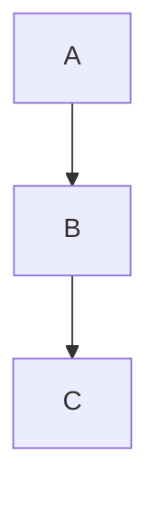

# Export as PDF — Implementation Plan (Plan 2 of 2)

> **For agentic workers:** REQUIRED SUB-SKILL: Use superpowers:subagent-driven-development (recommended) or superpowers:executing-plans to implement this plan task-by-task. Steps use checkbox (`- [ ]`) syntax for tracking.

**Goal:** Add a "File ▸ Export as PDF…" action that silently writes the active document as a paginated, always-light `.pdf` (no print panel), faithful to the on-screen render (math, Mermaid, code, tables, images).

**Architecture:** Reuse the HTML-export orchestrator already in `ui/app.js` (`onExport` → `exportDocument`), which already snapshots state and forces a **light** re-render. For PDF, `exportDocument` calls a new native Rust command `export_pdf`. That command reaches the macOS `WKWebView` through Tauri's `with_webview`, builds an `NSPrintInfo` with a save-to-file disposition, and runs `WKWebView.printOperationWithPrintInfo` with the print/progress panels suppressed — WebKit's own paginated print engine, written straight to the dialog-chosen path. A new `@media print` stylesheet hides the app chrome and reflows the preview; because `printOperationWithPrintInfo` renders through the print pipeline, those rules apply automatically during capture and never flash on screen.

**Tech Stack:** Tauri 2.11 + `objc2` 0.3-generation bindings (`objc2-app-kit`, `objc2-foundation`, `objc2-web-kit`) for the macOS print interop; vanilla-JS frontend (no build step); the existing `dialogApi.save` + `export` event channel from Plan 1.

**Scope note:** This is Plan 2 (PDF) of the split from `docs/superpowers/specs/2026-05-23-export-document-design.md`. Plan 1 (HTML) is already implemented; its `onExport`/`exportDocument` already compute PDF filters and pass `format === "pdf"` through — only the `exportDocument` dispatch branch and the native side are missing.

---

## Verification reality (read first)

Unlike Plan 1, almost nothing here is unit-testable: it's CSS, Objective-C FFI, and a native print that needs a GUI + save dialog. Plan accordingly:

- **Automated gates** (every task): `cd src-tauri && cargo build` must succeed, `cargo fmt --check` clean, `cargo clippy --all-targets -- -D warnings` clean; the existing tests stay green (`node --test ui/*.test.js` = 23 pass; `cargo test` = 37 pass); `node --check ui/app.js` for the JS task.
- **The native interop (Task 2) is a spike.** The objc2 0.3 API names, feature flags, and constants below were verified against docs.rs (`objc2-app-kit` 0.3.1, `objc2-web-kit` 0.3.1, `objc2-foundation` 0.3.1), but exact Rust coercions in FFI sometimes need a small compiler-guided tweak. Expect 1-3 `cargo build` iterations on Task 2. If a signature differs, consult the cited docs.rs page and adjust; do **not** guess blindly. Fallback if the interop proves intractable: see "Fallback" at the end.
- **Real correctness check is a manual smoke test** (Task 5), run by a human, since neither a subagent nor the controller can click a native menu/save dialog or inspect a rendered PDF.

---

## Reference facts (verified against the codebase and docs.rs)

- **Tauri webview access** (`tauri` 2.11.1): `WebviewWindow::with_webview(|pw| …)` runs the closure on the **main thread**. `PlatformWebview` (macOS) exposes `inner() -> *mut std::ffi::c_void` (the `WKWebView`) and `ns_window() -> *mut std::ffi::c_void` (the `NSWindow`). We only need `inner()`.
- **Command threading:** Tauri runs **synchronous** commands on the main thread and **async** commands off it. Because the command must block until the main-thread print closure finishes, `export_pdf` MUST be `async` (otherwise blocking on the result while the closure waits for the main thread would deadlock).
- **objc2 0.3 print API (verified signatures):**
  - `objc2_web_kit::WKWebView::printOperationWithPrintInfo(&self, print_info: &NSPrintInfo) -> Retained<NSPrintOperation>` — needs objc2-web-kit features `["WKWebView", "objc2-app-kit"]`.
  - `objc2_app_kit::NSPrintOperation`: `setShowsPrintPanel(&self, bool)`, `setShowsProgressPanel(&self, bool)`, `runOperation(&self) -> bool` — feature `"NSPrintOperation"`.
  - `objc2_app_kit::NSPrintInfo`: `dictionary(&self) -> Retained<NSMutableDictionary<NSPrintInfoAttributeKey, AnyObject>>`, `setJobDisposition(&self, &NSPrintJobDispositionValue)` — feature `"NSPrintInfo"`.
  - Statics (feature `"NSPrintInfo"`): `NSPrintJobSavingURL: &'static NSPrintInfoAttributeKey`, `NSPrintSaveJob: &'static NSPrintJobDispositionValue`.
  - `objc2_foundation::NSURL::fileURLWithPath(&NSString) -> Retained<NSURL>` (features `["NSURL","NSString"]`); `NSString::from_str(&str)`.
- **All objc2 0.3 print methods are `unsafe`** — wrap calls in `unsafe`.
- **CSS layout** (`ui/styles.css`): `body { display: grid; grid-template-areas: "banner banner banner" / "sidebar splitter preview"; height: 100vh }`. Chrome elements (by id from `index.html`): `#update-banner`, `#sidebar`, `#splitter`, `#tab-bar`, `#find-bar`, dynamic `#task-error-banner`; content path is `#preview-pane` (flex column, `overflow:hidden`) → `#preview-scroll` (`flex:1; overflow:auto`) → `#preview`.
- **Frontend (Plan 1, already present):** `onExport(format)` already builds PDF filters and calls `exportDocument(format, path)`; `exportDocument` already snapshots state, forces `currentTheme="light"`/`t.raw=false`, re-renders, and has an `if (format === "html") { await exportHtml(t, path); } // PDF is Plan 2.` block to extend. `invoke` is in scope.
- **Menu (`src-tauri/src/menu.rs`):** the File submenu has `…recent_submenu, separator, export_html, separator, close_window`; `on_menu_event` has an `"export-html" => { let _ = app.emit("export", "html"); }` arm. `app.emit` is available.
- **Command registration (`src-tauri/src/lib.rs`):** modules are declared at top (`mod commands; …`); the handler list is `tauri::generate_handler![commands::…]`.
- Commit style: imperative subject, NO `feat:` prefix, NO `Co-Authored-By` trailer.
- A smoke-test document already exists at `/tmp/export-check.md` (code, table, math, Mermaid). Recreate it if missing (content in Task 5).

---

## Task 1: Print stylesheet (`@media print`)

**Files:**
- Modify: `ui/styles.css` (append at end)

This hides the app chrome and reflows the preview so WebKit's print pipeline paginates the document only. It applies during the native print capture (and any future `window.print()` fallback) and never affects the on-screen view.

- [ ] **Step 1: Append the print rules**

Add to the very end of `ui/styles.css`:

```css
/* Print / PDF export: WKWebView.printOperationWithPrintInfo renders through the
   print pipeline, so these rules apply during PDF capture (and never on screen).
   Hide the app chrome and let the preview flow across pages. */
@media print {
  #update-banner,
  #sidebar,
  #splitter,
  #tab-bar,
  #find-bar,
  #task-error-banner,
  .export-btn-group,
  .copy-btn {
    display: none !important;
  }

  body {
    display: block !important; /* override the app grid */
    height: auto !important;
    background: #ffffff !important;
  }

  .preview-pane {
    display: block !important;
    overflow: visible !important;
  }

  .preview-scroll {
    overflow: visible !important;
    height: auto !important;
  }

  #preview {
    display: block !important;
  }

  /* Avoid splitting atomic blocks across page boundaries. */
  pre,
  table,
  img,
  pre.mermaid,
  .katex-display {
    break-inside: avoid;
  }

  @page {
    margin: 16mm;
  }
}
```

- [ ] **Step 2: Build (frontend is bundled at compile time)**

Run: `cd src-tauri && cargo build`
Expected: builds clean. (Visual effect is verified in Task 5's manual smoke test.)

- [ ] **Step 3: Commit**

```bash
git add ui/styles.css
git commit -m "Add print stylesheet for PDF export"
```

---

## Task 2: Native `export_pdf` command (macOS print interop) — SPIKE

**Files:**
- Create: `src-tauri/src/export.rs`
- Modify: `src-tauri/Cargo.toml` (add macOS objc2 deps)
- Modify: `src-tauri/src/lib.rs` (`mod export;` + register command)

This is the FFI spike. The code below is verified against docs.rs but may need a small compiler-guided coercion fix (see "Verification reality"). The automated gate is a clean `cargo build`.

- [ ] **Step 1: Add the objc2 dependencies (macOS target)**

In `src-tauri/Cargo.toml`, add a new target-specific dependency table after the existing `[dependencies]` block:

```toml
# macOS-only: native WKWebView print-to-PDF (paginated, silent save).
# Pinned to the same objc2 0.3-generation bindings Tauri 2.11 uses internally.
[target.'cfg(target_os = "macos")'.dependencies]
objc2 = "0.6"
objc2-foundation = { version = "0.3", features = ["NSString", "NSURL", "NSDictionary"] }
objc2-app-kit = { version = "0.3", features = ["NSPrintInfo", "NSPrintOperation"] }
objc2-web-kit = { version = "0.3", features = ["WKWebView", "objc2-app-kit"] }
```

- [ ] **Step 2: Create `src-tauri/src/export.rs`**

```rust
//! PDF export. On macOS, print the main webview to a file through the native
//! print pipeline (paginated) with the print/progress panels suppressed.

/// Print the calling window's webview to `path` as a PDF.
///
/// Async on purpose: Tauri runs sync commands on the main thread, but this
/// command blocks until the main-thread print closure finishes, so it must run
/// off the main thread to avoid a deadlock.
#[tauri::command]
pub async fn export_pdf(window: tauri::WebviewWindow, path: String) -> Result<(), String> {
    #[cfg(target_os = "macos")]
    {
        macos::export(window, path).await
    }
    #[cfg(not(target_os = "macos"))]
    {
        let _ = (window, path);
        Err("PDF export is only supported on macOS".to_string())
    }
}

#[cfg(target_os = "macos")]
mod macos {
    use std::sync::mpsc;

    use objc2_app_kit::{NSPrintInfo, NSPrintJobSavingURL, NSPrintSaveJob};
    use objc2_foundation::{NSString, NSURL};
    use objc2_web_kit::WKWebView;

    pub async fn export(window: tauri::WebviewWindow, path: String) -> Result<(), String> {
        let (tx, rx) = mpsc::channel::<Result<(), String>>();
        // with_webview runs the closure on the main thread, which
        // NSPrintOperation requires. This command is async (off the main
        // thread), so blocking on rx below cannot deadlock the closure.
        window
            .with_webview(move |pw| {
                let result = unsafe { print_to_file(pw.inner(), &path) };
                let _ = tx.send(result);
            })
            .map_err(|e| format!("with_webview failed: {e}"))?;
        rx.recv()
            .map_err(|e| format!("print task dropped: {e}"))?
    }

    /// # Safety
    /// `webview_ptr` must be the `WKWebView` pointer from `PlatformWebview::inner`
    /// on the main thread.
    unsafe fn print_to_file(webview_ptr: *mut std::ffi::c_void, path: &str) -> Result<(), String> {
        if webview_ptr.is_null() {
            return Err("null webview pointer".to_string());
        }
        let webview: &WKWebView = &*(webview_ptr as *mut WKWebView);

        // Save-to-file print info: disposition = save, destination URL in the
        // settings dictionary.
        let info = NSPrintInfo::new();
        info.setJobDisposition(NSPrintSaveJob);
        let url = NSURL::fileURLWithPath(&NSString::from_str(path));
        let settings = info.dictionary();
        settings.setObject_forKey(&*url, NSPrintJobSavingURL);

        // Paginated print straight to the file — no panels.
        let op = webview.printOperationWithPrintInfo(&info);
        op.setShowsPrintPanel(false);
        op.setShowsProgressPanel(false);
        if op.runOperation() {
            Ok(())
        } else {
            Err("print operation returned failure".to_string())
        }
    }
}
```

**If `cargo build` complains, apply the matching fix (in priority order):**
- `NSPrintInfo::new()` not found → replace with
  `NSPrintInfo::initWithDictionary(NSPrintInfo::alloc(), &objc2_foundation::NSDictionary::new())`
  (the `NSDictionary` feature is already enabled).
- `settings.setObject_forKey(&*url, NSPrintJobSavingURL)` type mismatch on the value
  (dict value type is `AnyObject`): coerce the URL, e.g.
  `settings.setObject_forKey(url.as_ref() as &objc2::runtime::AnyObject, NSPrintJobSavingURL);`
  (or `&*url` / `&**url` as the compiler directs). The key `NSPrintJobSavingURL`
  is already `&NSPrintInfoAttributeKey`; pass it as-is.
- A method/type "not found, perhaps a missing feature" → enable the cited feature on
  the corresponding crate in `Cargo.toml`. Verified pages:
  - https://docs.rs/objc2-web-kit/0.3.1/objc2_web_kit/struct.WKWebView.html#method.printOperationWithPrintInfo
  - https://docs.rs/objc2-app-kit/0.3.1/objc2_app_kit/struct.NSPrintOperation.html
  - https://docs.rs/objc2-app-kit/0.3.1/objc2_app_kit/struct.NSPrintInfo.html
- `with_webview` "method not found" → it is available without a feature in Tauri 2.11; ensure
  you call it on a `tauri::WebviewWindow` (which the command receives).

- [ ] **Step 3: Wire the module and command in `src-tauri/src/lib.rs`**

Add the module declaration next to the others (after `mod commands;`):

```rust
mod export;
```

Add the command to the `generate_handler!` list (after `commands::save_export,`):

```rust
            export::export_pdf,
```

- [ ] **Step 4: Build and lint (the automated gate)**

Run, iterating on compiler errors per Step 2's fix list until clean:
```bash
cd src-tauri && cargo build
cargo fmt
cargo fmt --check
cargo clippy --all-targets -- -D warnings
```
Expected (when done): build clean, fmt clean, clippy clean. Also confirm no regressions:
```bash
cargo test 2>&1 | grep "test result:"
```

- [ ] **Step 5: Commit**

```bash
git add src-tauri/Cargo.toml src-tauri/Cargo.lock src-tauri/src/export.rs src-tauri/src/lib.rs
git commit -m "Add native PDF export command (macOS WKWebView print)"
```

---

## Task 3: Add the "Export as PDF…" menu item

**Files:**
- Modify: `src-tauri/src/menu.rs`

- [ ] **Step 1: Build the item in `rebuild`**

Next to the existing `export_html` item builder, add:

```rust
    let export_pdf =
        MenuItemBuilder::with_id("export-pdf", "Export as PDF…").build(app)?;
```

- [ ] **Step 2: Insert it into the File submenu (right after Export as HTML)**

Change the File submenu builder so the export pair sits together:

```rust
    let file_menu = SubmenuBuilder::new(app, "File")
        .item(&open_file)
        .item(&open_folder)
        .item(&recent_submenu)
        .separator()
        .item(&export_html)
        .item(&export_pdf)
        .separator()
        .close_window()
        .build()?;
```

- [ ] **Step 3: Handle the event (next to the `export-html` arm)**

```rust
            "export-pdf" => {
                let _ = app.emit("export", "pdf");
            }
```

- [ ] **Step 4: Build and lint**

```bash
cd src-tauri && cargo build && cargo fmt --check && cargo clippy --all-targets -- -D warnings
```
Expected: clean.

- [ ] **Step 5: Commit**

```bash
git add src-tauri/src/menu.rs
git commit -m "Add Export as PDF menu item"
```

---

## Task 4: Frontend PDF dispatch

**Files:**
- Modify: `ui/app.js` (the `exportDocument` dispatch block)

`onExport` already handles the `"pdf"` format (filters + `exportFilename(t.path, "pdf")`) and `exportDocument` already does the light re-render and state restore. Only the dispatch branch is missing.

- [ ] **Step 1: Extend the dispatch**

In `exportDocument`, replace:

```js
    if (format === "html") {
      await exportHtml(t, path);
    }
    // PDF is Plan 2.
```
with:

```js
    if (format === "html") {
      await exportHtml(t, path);
    } else if (format === "pdf") {
      // The native print uses WebKit's print pipeline, so the @media print
      // stylesheet (chrome hidden, preview reflowed) applies during capture.
      await invoke("export_pdf", { path });
    }
```

- [ ] **Step 2: Verify**

```bash
cd /Users/laek/source/mdviewer && node --check ui/app.js && echo OK
node --test ui/*.test.js 2>&1 | grep -E "^# (tests|pass|fail)"
cd src-tauri && cargo build
```
Expected: `OK`; 23 tests, 23 pass; build clean.

- [ ] **Step 3: Commit**

```bash
git add ui/app.js
git commit -m "Dispatch PDF export to the native print command"
```

---

## Task 5: Document, verify, and smoke-test

**Files:**
- Modify: `CLAUDE.md`

- [ ] **Step 1: Document the PDF pipeline**

In `CLAUDE.md`, extend the **Export** bullet under "## Architecture quick-tour" — replace its final sentence
`PDF is a planned second format (see \`docs/superpowers/specs/\`).`
with:

```markdown
  **Export (PDF)** reuses the same `exportDocument` light re-render, then calls
  the native `export_pdf` command (`src-tauri/src/export.rs`, macOS-only):
  `with_webview` → `WKWebView.printOperationWithPrintInfo` with a
  save-to-file `NSPrintInfo` and the print/progress panels suppressed (objc2
  0.3 bindings). It's WebKit's paginated print engine written straight to the
  dialog-chosen path. The `@media print` block in `styles.css` hides the app
  chrome and reflows the preview; because the native print renders through the
  print pipeline, those rules apply during capture and never flash on screen.
```

Add to "## Things that took hours and shouldn't again":

```markdown
- **PDF export is native objc2 FFI**: `export_pdf` must be an **async** command —
  Tauri runs sync commands on the main thread, and `with_webview`'s closure also
  runs on the main thread, so a sync command blocking on the closure's result
  would deadlock. Use `WKWebView.printOperationWithPrintInfo` (paginated) with
  `setShowsPrintPanel(false)` + `NSPrintSaveJob` + `NSPrintJobSavingURL`, NOT
  `createPDF` (which emits a single oversized page). The objc2 crates are pinned
  to the 0.3 generation Tauri 2.11 uses; mismatched versions break the
  `inner()`-pointer cast. `@media print` (not a screen class) drives the layout
  so there's no on-screen flash.
```

- [ ] **Step 2: Full verification suite**

```bash
cd /Users/laek/source/mdviewer
node --test ui/*.test.js 2>&1 | grep -E "^# (tests|pass|fail)"
node --check ui/app.js && echo APPJS_OK
cd src-tauri && cargo fmt --check && cargo clippy --all-targets -- -D warnings 2>&1 | tail -2 && cargo test 2>&1 | grep "test result:" && cargo build 2>&1 | tail -2
```
Expected: 23 JS tests pass; `APPJS_OK`; fmt clean; clippy clean; `cargo test` 37 passed; build clean.

- [ ] **Step 3: Manual smoke test (human-run — required)**

Recreate the test doc if needed:
```bash
test -f /tmp/export-check.md || cat > /tmp/export-check.md <<'EOF'
# Export check

Some **bold** text and `inline code`.

| A | B |
|---|---|
| 1 | 2 |

Inline math $a^2 + b^2 = c^2$ and display:

$$E = mc^2$$

```rust
fn main() { println!("hi"); }
```


EOF
```
Then run and export:
```bash
cd /Users/laek/source/mdviewer/src-tauri && cargo run -- /tmp/export-check.md
```
In the app: **File ▸ Export as PDF…**, save to `/tmp/export-check.pdf`. Verify, with the Mac in **dark mode**:
- **No print panel appears** — it saves silently.
- The preview briefly flashes light (the export re-render), then restores.
- Open the PDF (`open /tmp/export-check.pdf`): it is **light** (white pages), **paginated** (multiple pages if long), with NO sidebar/tabs/toolbar — document only.
- Code is syntax-highlighted, both math expressions render, the table renders, and the Mermaid diagram renders.
- `mdls -name kMDItemContentType /tmp/export-check.pdf` reports `com.adobe.pdf` (confirms a real PDF, not an error file).

If the PDF is empty/0 bytes or the file isn't created, check the `cargo run` terminal for the `export_pdf` error string and the WebView console (right-click ▸ Inspect Element on the debug build).

- [ ] **Step 4: Commit**

```bash
git add CLAUDE.md
git commit -m "Document PDF export pipeline"
```

---

## Fallback (if the native interop proves intractable)

If Task 2 can't be made to compile/run reliably within a reasonable spike, fall back to `window.print()`:
- Task 4 branch becomes `else if (format === "pdf") { window.print(); }` (the save dialog in `onExport` is then redundant for PDF — skip it for `"pdf"`).
- Tasks 1 (print CSS) and 3 (menu item) stay as-is; the `@media print` stylesheet already does the chrome-hiding/reflow.
- Drop Task 2 entirely (no objc2 deps, no `export.rs`).
- Trade-off: the OS print panel appears (user picks "Save as PDF") instead of a silent save. Update the docs accordingly.
This keeps the feature shippable even if the FFI path is abandoned. Prefer the native path; this is the safety net.

---

## Self-review (completed during planning)

- **Spec coverage (PDF slice):** silent paginated PDF via native print (Task 2) ✓; always-light via the reused light re-render + `@media print` white background, with WebKit's print context defaulting to light (Task 1 + reused `exportDocument`) ✓; chrome hidden / document-only (Task 1) ✓; trigger = File ▸ Export as PDF… emitting `export`/`pdf` (Task 3), dispatched in `exportDocument` (Task 4) ✓; reuses the Plan-1 orchestrator + save dialog ✓; docs (Task 5) ✓. The spec's hypothesized `body.exporting` class is intentionally replaced by `@media print` alone — better, because it avoids an on-screen flash while still applying during the native print pipeline (documented in Task 1 + CLAUDE.md).
- **Placeholder scan:** none — full code in every step. Task 2's "if the compiler complains" list is concrete remediation for known FFI-coercion variance, not deferred work; the primary code is complete.
- **Type/name consistency:** command name `export_pdf` matches `lib.rs` registration, the `invoke("export_pdf", { path })` call site, and the `export.rs` definition; the `export`/`pdf` event payload matches `onExport`'s existing `format === "pdf"` handling (Plan 1); menu id `export-pdf` matches its `on_menu_event` arm; objc2 symbols (`printOperationWithPrintInfo`, `NSPrintInfo`, `NSPrintOperation`, `NSPrintSaveJob`, `NSPrintJobSavingURL`, `NSURL::fileURLWithPath`) and their feature flags match the verified docs.rs signatures.
- **Risk note:** the only non-deterministic part is the Task 2 FFI spike; the Fallback section guarantees the feature is still shippable if the native path is abandoned.
