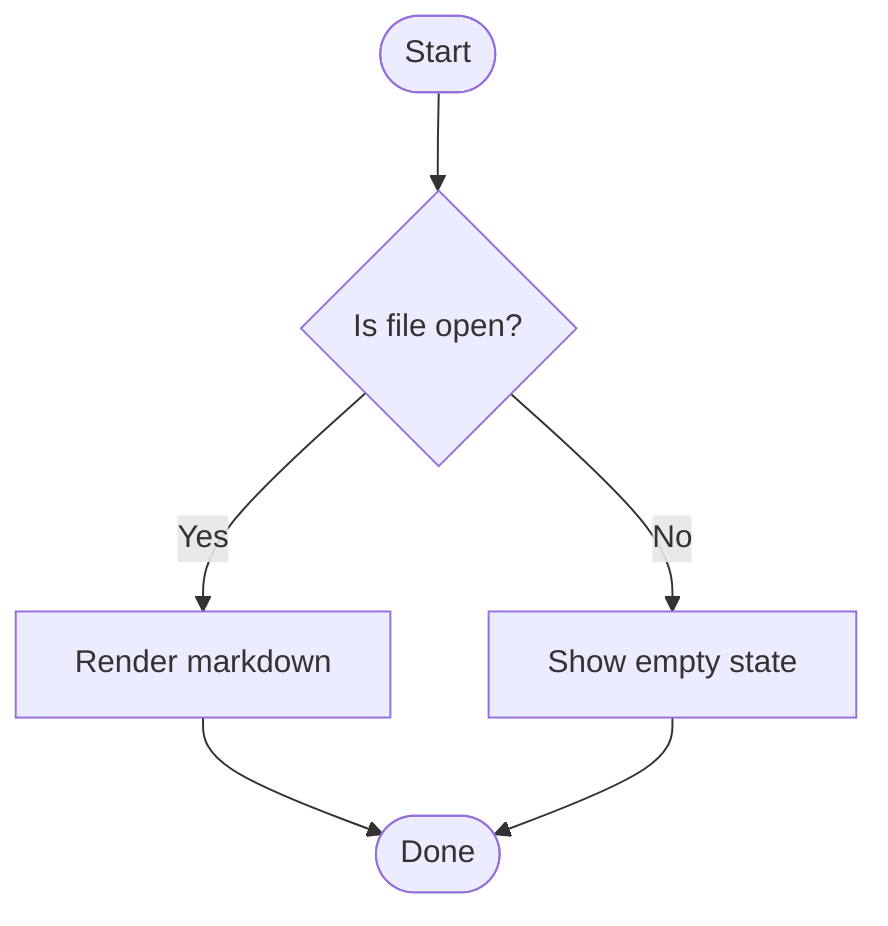
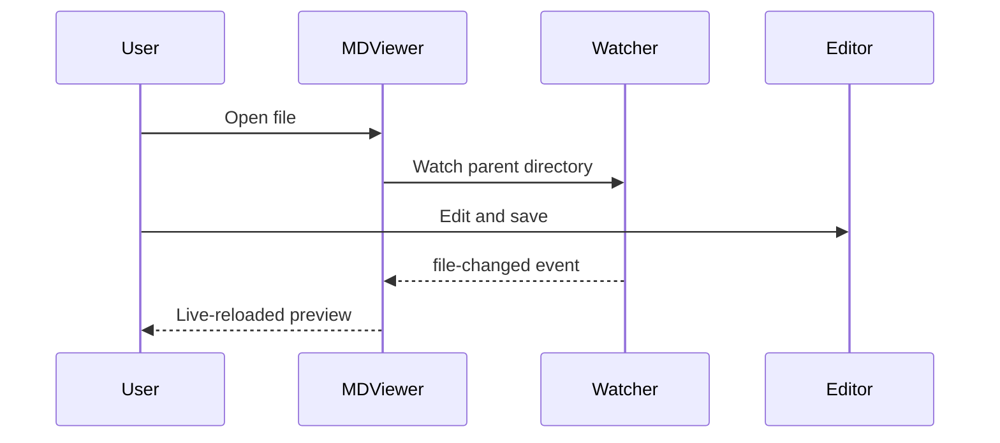

# Mermaid Diagrams

MDViewer renders Mermaid diagrams inline. The source is a fenced code block with the `mermaid` info string.

## Flowchart

```mermaid
flowchart TD
    A([Start]) --> B{Is file open?}
    B -- Yes --> C[Render markdown]
    B -- No  --> D[Show empty state]
    C --> E([Done])
    D --> E
```

## Sequence Diagram

```mermaid
sequenceDiagram
    participant User
    participant MDViewer
    participant Watcher

    User->>MDViewer: Open file
    MDViewer->>Watcher: Watch parent directory
    User->>Editor: Edit and save
    Watcher-->>MDViewer: file-changed event
    MDViewer-->>User: Live-reloaded preview
```
